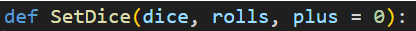
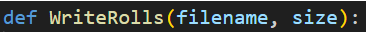

```{r setup, include=FALSE}
knitr::opts_chunk$set(echo = TRUE)
```

## Dice Roll Analysis

This document analyses a series of runs of a dice roll generator. It simulates the roll of multiple dice the resultant numbers being summed. The back end is a C++ library that uses a normal distribution random number generator. It is supplied with Min, Max, Mean and Standard Deviation for the proposed dice roll.

The C++ code is wrappered and called from Python. The exposed SetDice function is used to establish the dice rolling parameters.

{width="300" height="22"}

dice: the number of sides on the dice.\
rolls: the number of dice that are rolled in one roll.\
plus: an optional parameter to add a value to each roll.

The WriteRolls function is use to write a series of rolls to a file given the set parameters.

{width="267" height="23"}

filename: the name of the file to be written to.\
size: the number if dice rolls to be generated and written to file. #Test 1 Commonly in my tests I use this function to 10,000,000 values to the file.

## Run 01

3d6

10,000,000 samples

Dice: 6, Rolls: 3, Plus: 0, Mean: 10.500000, stddev: 2.958040, min: 3, max: 18

```{r 3d6 analysis, echo=FALSE}
rolls_tbl <- read.table("C:\\Data\\Rolls\\Data\\Results3d6.txt", head=FALSE)
rolls <- rolls_tbl[[1]]
cat("Mean:\t", mean(rolls))
cat("\nStddev:\t", sd(rolls))
cat("\nMin:\t", min(rolls))
cat("\nMax:\t", max(rolls))
```

```{r 3d6 unique count plot}
value_counts <- table(rolls)

# Create a bar plot
barplot(value_counts, main="Counts of Unique Values", xlab="Values", ylab="Frequency")
```

## Run 02

10d6

10,000,000 samples

Dice: 6, Rolls: 10, Plus: 0, Mean: 35.000000, stddev: 5.400617, min: 10, max: 60

```{r 3d6 analysis, echo=FALSE}
rolls_tbl <- read.table("C:\\Data\\Rolls\\Data\\Results10d6.txt", head=FALSE)
rolls <- rolls_tbl[[1]]
cat("Mean:\t", mean(rolls))
cat("\nStddev:\t", sd(rolls))
cat("\nMin:\t", min(rolls))
cat("\nMax:\t", max(rolls))
```

```{r 3d6 unique count plot}
value_counts <- table(rolls)

# Create a bar plot
barplot(value_counts, main="Counts of Unique Values", xlab="Values", ylab="Frequency")
```

## Run 03

20d6

10,000,000 samples

Dice: 6, Rolls: 20, Plus: 0, Mean: 70.000000, stddev: 7.637626, min: 20, max: 120

```{r 3d6 analysis, echo=FALSE}
rolls_tbl <- read.table("C:\\Data\\Rolls\\Data\\Results20d6.txt", head=FALSE) 
rolls <- rolls_tbl[[1]] 
cat("Mean:\t", mean(rolls)) 
cat("\nStddev:\t", sd(rolls)) 
cat("\nMin:\t", min(rolls)) 
cat("\nMax:\t", max(rolls))
```

```{r 3d6 unique count plot}
value_counts <- table(rolls)  
# Create a bar plot 
barplot(value_counts, main="Counts of Unique Values", xlab="Values", ylab="Frequency")
```

# Test 2

The previous test show a discrepancy in the standard deviation that is higher with lower numbers of rolls. I could be related to rounding in the random values that are created on a curve. Linear rounding would produce an error.

##Method 2 A new C++ backend is developed that only predicts a linear random value for each dice, and then adds them up for each roll. This should be more accurate but may take longer to produce the results. To speed this up I have made the generator multithreaded and able to use Max-1 threads a computer has.

We will reproduce the previous test with the new generator.
